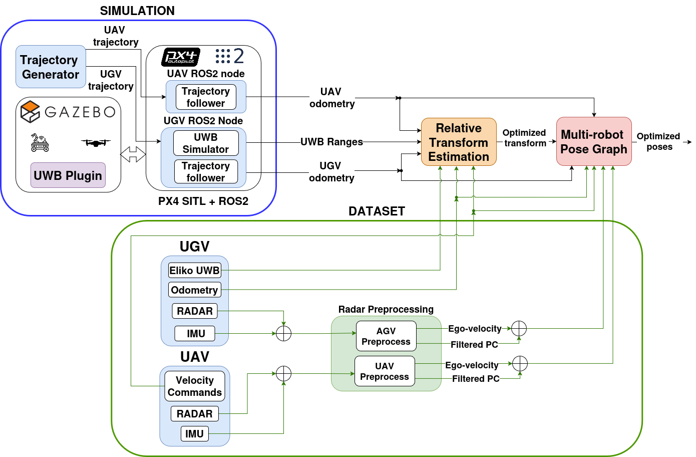
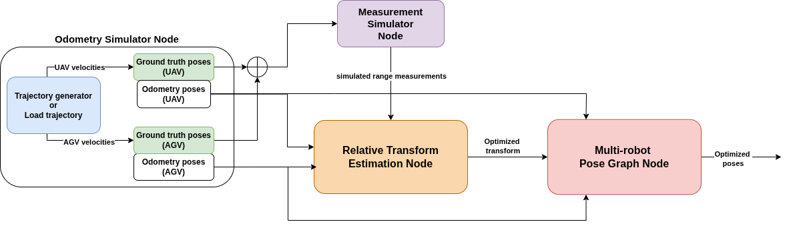

<h1 align="center"><a href="https://arxiv.org/abs/2509.26558" style="text-decoration:none;color:inherit;">Radio-based Multi-Robot Odometry and Relative Localization</a></h1>

<div align="center">
  <a href="https://www.youtube.com/watch?v=zTdIhjTZPeA"></a>
  <a href="https://arxiv.org/abs/2509.26558"></a>
  </a>
</div>

❗ **This work has been accepted to ICRA 2026!**

### Abstract
Radio-based methods such as Ultra-Wideband (UWB) and RAdio Detection And Ranging (RADAR), which have traditionally seen limited adoption in robotics, are experiencing a boost in popularity thanks to their robustness to harsh environmental conditions and cluttered environments. This work proposes a multi-robot UGV-UAV localization system that leverages the two technologies with inexpensive and readily-available sensors (Inertial Measurement Units, or IMUs, and wheel encoders) to estimate the relative position of an aerial robot with respect to a ground robot. The first stage of the system pipeline includes a nonlinear optimization framework to trilaterate the location of the aerial platform based on UWB range data, and a RADAR pre-processing module with loosely coupled ego-motion estimation which has been adapted for a multi-robot scenario. Then, the pre-processed RADAR data as well as the relative transformation are fed to a pose-graph optimization framework with odometry and inter-robot constraints. The system, implemented for the Robotic Operating System (ROS 2) with the Ceres optimizer, has been validated in Software-in-the-Loop (SITL) simulations and in a real-world dataset. The relative localization module outperforms state-of-the-art closed-form methods which are less robust to noise. Our SITL environment includes a custom Gazebo plugin for generating realistic UWB measurements modeled after real data.  Conveniently, the proposed factor graph formulation makes the system readily extensible to full Simultaneous Localization And Mapping (SLAM).  Finally, all the code and experimental data have been made publicly available to support reproducibility and to serve as a common open dataset for benchmarking.

## Basic Dependencies

* Ubuntu 22.04 LTS and ROS 2 [Humble](https://docs.ros.org/en/humble/index.html) or Ubuntu 24.04 LTS and ROS 2 [Jazzy](https://docs.ros.org/en/jazzy/index.html)
* [Ceres Solver](https://github.com/ceres-solver/ceres-solver)
* [Sophus](https://github.com/strasdat/Sophus)
* [pcl_ros](https://github.com/ros-perception/perception_pcl)
* [small_gicp](https://github.com/koide3/small_gicp)
* [eliko_ros](https://github.com/robotics-upo/eliko_ros)
* [ars548_ros](https://github.com/robotics-upo/ars548_ros)
* [4D-Radar-Odom](https://github.com/robotics-upo/4D-Radar-Odom/tree/arco-drone-integration) branch ```arco_drone_integration```.

Clone this repository along with the dependency packages to your ROS 2 workspace and compile with the standard ```colcon build``` command. Please follow the links above to the mentioned packages for specific setup instructions for each of them. 

**Note**: if you want to use the PX4/Gazebo SITL setup, treat [`UWBPX4Sim`](https://github.com/amartinezsilva/UWBPX4Sim/blob/main/README.md) as the source of truth for all simulation-specific instructions. This parent repository focuses on the localization stack itself.

## Cloning this repository

To clone the parent repository together with the ```UWBPX4Sim``` submodule:

```bash
git clone --recurse-submodules https://github.com/amartinezsilva/mr-radio-localization.git
cd mr-radio-localization
```

## PX4 / Gazebo SITL note

All SITL-specific dependencies, generated-model workflow, PX4 integration, ROS 2 bridge/offboard package setup, launcher usage, and plugin configuration are documented in [`UWBPX4Sim`](https://github.com/amartinezsilva/UWBPX4Sim/blob/main/README.md).

In particular, use the `UWBPX4Sim` README for:

- Gazebo Harmonic and PX4 SITL setup
- QGroundControl and Micro XRCE-DDS setup
- UWB layout generation
- generated model installation into PX4
- `px4_sim_offboard` build and launch
- UWB plugin configuration and bridge topics

**Disclaimer**: the PX4 SITL simulation has been tested with ROS 2 Jazzy only, while the rest of the implementation has been tested in both ROS 2 Humble and ROS 2 Jazzy.


## Main components

This repository contains two ROS2 packages:

* ```uwb_localization```: includes the UWB-based relative transformation estimation node and the pose-graph optimization node with radar constraints. The ```config``` folder in this package contains the parameter file for these two nodes, in the simulation variant without radar (``params_sim.yaml``) and the dataset variant with radar (``params_dataset.yaml``), using our setup-specific configuration.


* ```UWBPX4Sim``` (Git submodule): includes the UWB plugin, modified UAV and UGV models for PX4 SITL, the ROS 2 bridge/offboard package, and the simulator launcher. Detailed setup, plugin parameters, and usage instructions are documented in [the ```UWBPX4Sim``` README](https://github.com/amartinezsilva/UWBPX4Sim/blob/main/README.md).



* ```uwb_simulator```: includes a very basic odometry simulation node and a range measurement simulation node (no SITL, no radar) using generic odometry and a basic measurement model, meant for debugging purposes only.  The ```config``` folder in this package contains the parameter file for these two nodes.



## Launch files

```uwb_localization``` contains three launch files. To launch the real world dataset experiment (which includes radar odometry), type:
``` 
ros2 launch uwb_localization localization_dataset.launch.py
```
**Note**: You can find and download the real-world dataset as a .bag file in [Harvard Dataverse](https://dataverse.harvard.edu/dataset.xhtml?persistentId=doi:10.7910/DVN/KNKWMJ). The original dataset was recorded in ROS 2 Humble and as a consequence has the SQLite ``.db3`` format. If you are using ROS Jazzy, you may have to convert it first to the new standard ``.mcap`` format with [this tool](https://mcap.dev/guides/getting-started/ros-2). 

The second launcher ``localization.launch.py`` executes just the main system (without the radar odometry nodes) and is used in the SITL scenario launched from the simulator tools documented in [the ```UWBPX4Sim``` README](https://github.com/amartinezsilva/UWBPX4Sim/blob/main/README.md). 


The third and final launcher is a basic simulated scenario with just UWB and generic odometry (no SITL). To use it, type:
``` 
ros2 launch uwb_localization localization_sim.launch.py

```


## PX4 SITL Simulator

The SITL simulator is owned by the [`UWBPX4Sim`](https://github.com/amartinezsilva/UWBPX4Sim/blob/main/README.md) submodule.

Use that repository for:

- simulator setup instructions
- layout-file configuration
- model generation
- PX4 plugin installation
- bridge/offboard launch behavior
- multi-vehicle simulation

Once the simulator is set up and you have recorded data or have the ROS topics available, this parent repository provides the localization launch files that consume those topics.

# Run localization with recorded data

Both launch files ```localization.launch.py``` and ```localization_dataset.launch.py``` in the main package ```uwb_localization``` look for bag files with a name provided by the user in the ```bags/``` folder. The first launch file is intended to be used with simulated data, and the second launch file has some extra processing for real experiment data. 

# Troubleshooting

* At the moment, compilation of package ``uwb_localization`` may fail due to CMake not being able to find the ``Sophus`` library when it has been installed from package repositories (e.g ``vcpkg`` or ``apt``). To overcome this, please install ``Sophus`` from source following these steps, then compile the workspace again.
```
git clone https://github.com/strasdat/Sophus.git
cd Sophus
mkdir build && cd build
cmake ..
sudo make install
```

* Make sure you have set up the [ars_548](https://github.com/robotics-upo/ars548_ros) package following the instructions in the repo, particularly don't forget to install ``tclap`` which may cause compilation errors if it is not correctly set up.

```
sudo apt-get install libtclap-dev
```

* In Ubuntu 24.04 LTS and ROS 2 Jazzy, there is a [previously reported issue](https://discuss.px4.io/t/dds-faild-to-connect-ros2-jazzy/47966/3) that prevents the MicroXRCE Agent from connecting to the PX4 topics. This is because, when building the Micro-XRCE-DDS Agent on Ubuntu 24.04 (ROS 2 Jazzy) as part of the SITL setup, there may be a conflict between the locally built libraries (FastDDS/FastCDR) and the ones provided by the ROS 2 Jazzy default installation (``opt/ros``). The more straightforward workaround would be to tell your shell to look at your local build folders before the ROS folders by placing your paths at the beginning of the ``LD_LIBRARY_PATH``. To do it, find exactly where your libraries are located (replace ``path`` with the directory where you have cloned Micro-XRCE-DDS-Agent).

```
find <path>/Micro-XRCE-DDS-Agent/build -name "libfastrtps.so*" | grep temp_install
find <path>/Micro-XRCE-DDS-Agent/build -name "libfastcdr.so*" | grep temp_install
```
Take note of the directories containing these files. They usually end in /lib. Then, add the following line to your ``.bashrc`` or ``.zshrc`` file using the paths you have found in the previous step, for example: 
```
export LD_LIBRARY_PATH=/home/YOUR_USER/Micro-XRCE-DDS-Agent/build/temp_install/fastrtps-2.14/lib:/home/YOUR_USER/Micro-XRCE-DDS-Agent/build/temp_install/fastcdr-2.2.0/lib:$LD_LIBRARY_PATH
```

Close the file and source it to apply the changes. After this, the agent should connect as expected and you should see the ROS 2 topics. 

**COMING SOON**: We are preparing docker images with a complete functional setup to avoid these issues, and they will be ready soon. Please stay put. 


# Acknowledgements

This work was supported by the grants PICRAH 4.0 0 (PLEC2023-010353): funded by the Spanish Ministry of Science and Innovation and the Spanish Research Agency (MCIN/AEI/10.13039/501100011033); and INSERTION (PID2021-127648OB-C31), funded by “Agencia Estatal de Investigación – Ministerio de Ciencia, Innovación y Universidades” and the “European Union NextGenerationEU/PRTR”.


